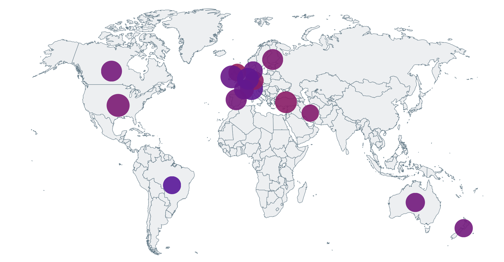
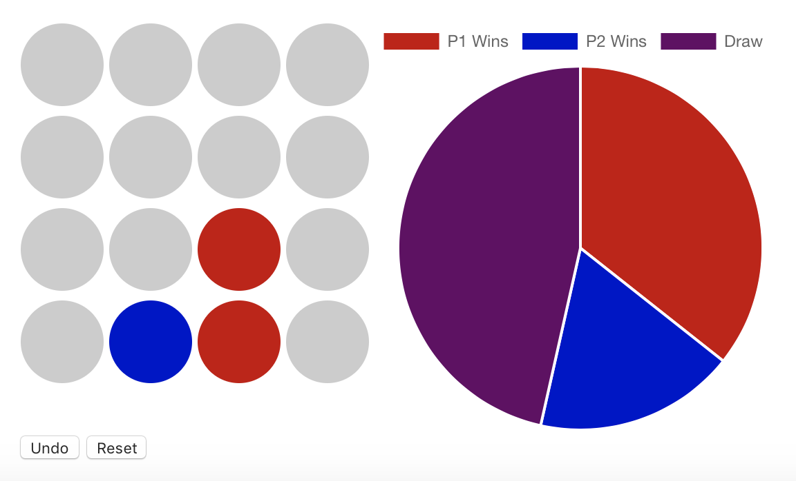

# 98point6 Data Science Assignment

## Exploratory Analysis
The notebook located at backend/datascience_hw.ipynb contains exploratory analysis
and automation to load data from the user data API, as well as generated Elo ratings
and player rankings, into user_data.csv.

This notebook would later form the basis of analytical/data load scripts and the
backend API.

There are a few key computations and visualizations to note:

#### Analyze and plot starting moves
This generates a graph to compare the prevalence of starting moves across all games.
The results show that starting moves are fairly equally distributed.

#### Analyze results by starting move
This analyzes the eventual results of games started with each of the 4 possible
starting moves, and graphs the win/lose/draw percentages for each. Despite starting
moves being fairly equally distributed, it turns out that plays in column 1 and column
4 seem to give the first player a distinct, measurable advantage.

#### Explore results by move sequence
This is a first attempt at building the functionality used later by the backend
API to show the results for the given move sequence (win/lose/draw) based
on past game data

#### When do you consider a game "called"?
This attempts to take the exploration of results by starting move further, and
explore in aggregate, after how many moves we can show a two-thirds margin of victory
one way or another. Turns out we can start "calling" games in this way after just
a few turns, depending on the desired margin. This helps us answer whether the
early game really does determine the outcome--it does seem to be the case.

#### Calculating Elo ratings and rankings for each player
Using a rating system similar to chess, we calculate scores for each player. This
comes in useful later when we want to look at whether players in one country are,
on average, better or worse than players in other countries. We don't want this to
be skewed by the number of games a player has played or not (if a player in a country
has played disproportionately more than anyone else), or to rely on simple
win/loss ratios since those can be quite misleading.

#### Download player metadata and serialize to CSV
Pulls player metadata from the user API, links it to game stats for each player, and
serializes the extra metadata to CSV so it can be loaded by the backend.

#### Roll up ratings by nationality
Collect Elo ratings for all players in a given country, and plot the distribution and
some descriptive statistics so we can compare. The median and mean ratings for all
countries are strikingly similar, and the distributions of scores in each country
tends to follow a fairly normal distribution centered at score of 0. The differences
between countries are fairly slight when you look at the data in this way.

## Backend API
The backend is a Flask app that reads from game_data.csv and user_data.csv and
serves an API with the following endpoints:

#### /games
Returns data about all games

#### /games/<game_id>
Returns data about a specific game

#### /players
Returns data about all players

#### /players/<player_id>
Returns data about a specific player

#### /stats
Returns stats regarding every nationality

#### /stats/<nationality>
Returns stats about a specific nationality

#### /results?moves=<move_sequence>
Returns results for the given move sequence based on past game data

### Running the API
From `backend/`

`pip install -r requirements.txt`

`export FLASK_APP=api.py`

`python -m flask run`

The backend should run on http://localhost:5000

## Frontend
The frontend is a React app that reads from the Flask backend. It provides two key
visualizations

#### Map view

Plots bubbles for each country on the map, with the size of each bubble corresponding
to how many players (samples) we have from each country, and the color of the bubble
ranging from red to blue according to whether the mean rating of the players from
that country is higher or lower than the mean rating of players globally. You can hover
over each bubble to see more descriptive statistics (min/max/median/mean/stdev).

#### Interactive game board

You can play a game of 9dt interactively in the browser. As you play, you can see
a pie chart that updates live to predict the outcome of the game. This could be a
compelling visualization to demonstrate with data how the outcome of the game can be
determined in just a few moves.

### Running the frontend
You'll require node/npm.

From `frontend/`

`npm install`

`npm start`

The frontend should run on http://localhost:3000
